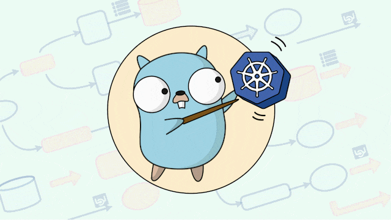

<div align=center>
  <h1> Node Drain Example </h1>
  
</div>

<br/>
<br/>

This is an example on how to safely evict pods from a node with the help of `drain` command and PodDisruptionBudgets (PDBs).

Repository Contents:

- a simple [fastify](https://www.fastify.io/) server dockerized and pushed to [Docker Hub](https://hub.docker.com/).
- Manifest files for creating a Deployment, a Service and a PodDisruptionBudget.

---

I am going to use [minikube](https://minikube.sigs.k8s.io/docs/start/) in multi-node clusters to show how to safely evict pods.

> You can deploy it to other cloud managed kubernetes like AWS or GKE with no changes to yaml files.

To start minikube with three nodes you can run 

```bash
minikube start --nodes 3 -p multinode-cluster
```

After some minutes when the minikube cluster is ready and running you can create a namespace for the example 

```bash
kubectl create namespace node-drain
```

Then you can create the resources located in the `./k8s-manifest` folder

```bash
kubectl apply -f ./k8s-manifests
```

You can verify the deployment is working by checking pods with 

```bash 
kubectl get pods -n node-drain

# output should be like
NAME                              READY   STATUS    RESTARTS   AGE
fastify-server-77476f7bc4-78zkv   1/1     Running   0          45m
fastify-server-77476f7bc4-9h6bf   1/1     Running   0          45m
fastify-server-77476f7bc4-cnh9r   1/1     Running   0          45m
fastify-server-77476f7bc4-cqs2z   1/1     Running   0          45m
fastify-server-77476f7bc4-fn5nn   1/1     Running   0          45m
fastify-server-77476f7bc4-nvnkl   1/1     Running   0          45m
fastify-server-77476f7bc4-pt5xz   1/1     Running   0          45m
fastify-server-77476f7bc4-r2btz   1/1     Running   0          45m
fastify-server-77476f7bc4-r92b7   1/1     Running   0          45m
fastify-server-77476f7bc4-xstrj   1/1     Running   0          45m

# if the status is ContainerCreating give it some seconds until pods start running
```

You can also verify that your PDB is working and pointing to the deployment by running

```bash
kubectl describe pbd fastify-budget -n node-drain
# fastify-budget is the name we gave for the PDB
```

and you should see something like 

```bash 
Name:             fastify-budget
Namespace:        node-drain
Max unavailable:  1
Selector:         app=fastify_server
Status:
    Allowed disruptions:  1
    Current:              10
    Desired:              9
    Total:                10
Events:                   <none>
```

You can view at what node each pod runs with 

```bash
kubectl describe nodes
```

You can choose which node to drain and start by marking it as unschedulable (as you don't want new pods to be scheduled while you are draining the node)

> When you drain a node, the node gets into a SchedulingDisabled state automatically.

```bash
kubectl cordon <node-name>
```

Drain node ([Command docs](https://kubernetes.io/docs/reference/generated/kubectl/kubectl-commands#drain))

```bash
kubectl drain <node-name> --ignore-daemonsets --delete-local-data

# You can in another terminal run a watch command in pods so you can see how they behave while draining node
kubectl get pods -n node-drain --watch
```

By running the above command you can see by the logs that not all pods get instantly terminated as they would violate PodDisruptionBudget

>Cannot evict pod as it would violate the pod's disruption budget.

---

<div align=center>

This repository is part of an article you can find [here](https://dev.to/gkampitakis/kubernetes-node-drain-by-example-3l28)

</div>

<br/>

❓ [For any questions](https://github.com/gkampitakis/node-drain-example/discussions)

❗ [For any issues](https://github.com/gkampitakis/node-drain-example/issues)
